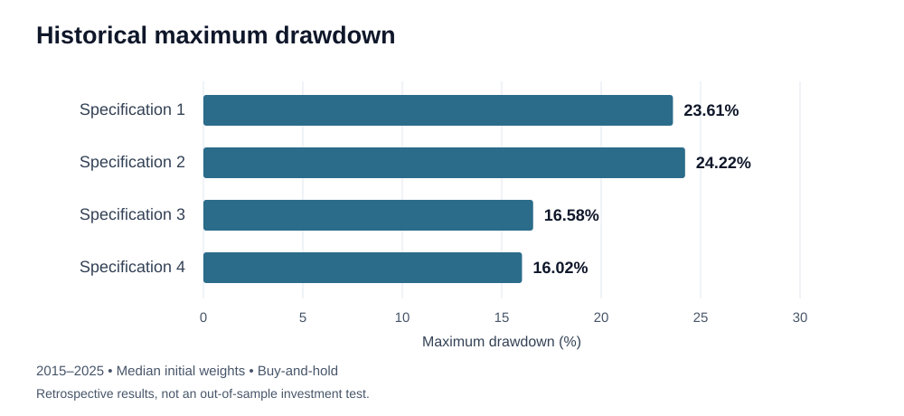

# All-Weather Portfolio Optimisation

[](https://doi.org/10.5281/zenodo.20232640)
[](LICENSE)
[](https://www.python.org/)

**English** | [Русский](README.ru.md)

A Python research project exploring how the allocation of an all-weather portfolio changes across risk-return objectives, asset universes and historical windows. The empirical study uses Russian equity and bond indices and gold, with data spanning **14 January 2015 to 30 December 2025**.

The repository contains the code, input data and results of my master's thesis and subsequent research prepared for a scientific publication.

**Author:** Lev Kazakov  
**Academic supervisor:** A. O. Soldatova, Candidate of Economic Sciences, Associate Professor

## Project at a glance

- **Question:** How sensitive are portfolio allocations to the choice of optimisation criterion, time window and asset universe?
- **Implementation:** Market-data preparation, constrained portfolio optimisation, benchmark comparisons, sensitivity analysis and econometric analysis in Python.
- **Main output:** Empirical allocation ranges rather than a single supposedly optimal portfolio.
- **Tools:** pandas, NumPy, SciPy, statsmodels, Matplotlib, seaborn and notebook-based tests.
- **Start here:** [Main notebook](main_code.ipynb) · [Installation and execution](#getting-started) · [Limitations](#limitations)

> This is retrospective research, not an investment recommendation or a live trading system. Portfolio weights are estimated using the full historical sample, so the forecasting exercise is not an end-to-end out-of-sample test of portfolio construction.
>
> The author confirms that the README results were prepared after the latest notebook run and that the computational code has not changed since that run. This documentation update does not constitute an independent rerun or numerical validation. See the notebook and exported tables for the implementation and underlying outputs.

## Research design

The study compares four asset universes combining Moscow Exchange equity indices, bond indices (including Russian federal government bonds, or **OFZ**) and gold.

The main portfolio assumption is **buy-and-hold**:

- Initial asset weights are obtained from the optimisation procedure.
- No rebalancing takes place after portfolio formation.
- Portfolio returns account for the subsequent drift in asset weights.
- The baseline risk-free rate is the full-sample mean of daily one-year OFZ zero-coupon yields: **9.57%**.
- The minimum acceptable return (**MAR**) combines average inflation of 7.33% with a 3-percentage-point real premium using compounding: **10.55%**.
- Each metric–configuration group receives equal weight when results are aggregated.

The aligned datasets contain **2,062–2,063 trading-day observations**, depending on the asset universe.

### Optimisation grid

Each of **eight objectives** is evaluated over **27 configurations**:

| Parameter | Values |
|---|---|
| Historical window | 2, 3 or 4 years |
| Window shift | 2, 3 or 6 months |
| Tikhonov regularisation strength | 0, 0.05 or 0.10 |
| Portfolio constraints | Long-only; maximum 60% per asset |

The objectives are the Sharpe ratio, Sortino ratio, Calmar ratio, CVaR ratio (α = 0.05), Martin ratio, Omega ratio, volatility and maximum drawdown.

The optimisation results are summarised as **empirical allocation ranges (P10–P90)** across **216 metric–configuration groups**. These are sensitivity ranges, not statistical confidence intervals or recommended trading weights.

## Portfolio results

### Asset universes

| Specification | Asset series | Observations |
|---|---|---|
| 1 | MCFTR, RUABITR, GLDRUB_TOM | 2,062 |
| 2 | MCFTR, RGBITR, GLDRUB_TOM | 2,063 |
| 3 | MCFTR, RUGBITR3Y, RUGBITR10Y, GLDRUB_TOM | 2,063 |
| 4 | MEBCTR, RUGBITR3Y, RUGBITR10Y, GLDRUB_TOM | 2,062 |

### Median allocations

| Specification | Equities | Bonds / shorter-maturity OFZ | Longer-maturity OFZ | Gold |
|---|---|---|---|---|
| 1 | 18.69% | 52.13% (RUABITR) | — | 29.19% |
| 2 | 19.79% | 50.98% (RGBITR) | — | 29.23% |
| 3 | 10.41% | 54.07% (RUGBITR3Y) | 13.35% | 22.17% |
| 4 | 9.21% (MEBCTR) | 55.07% (RUGBITR3Y) | 13.52% | 22.20% |

The median gold allocation exceeds the 15% reference allocation used for the original all-weather benchmark in each specification.

### Historical performance at median initial weights

| Portfolio | CAGR, % | Volatility, % | Sharpe | Sortino | Calmar | Max. drawdown, % |
|---|---|---|---|---|---|---|
| Specification 1 | 15.84 | 10.59 | 0.540 | 0.596 | 0.671 | 23.61 |
| Specification 2 | 16.29 | 11.17 | 0.552 | 0.618 | 0.673 | 24.22 |
| Specification 3 | 14.85 | 8.41 | 0.552 | 0.591 | 0.896 | 16.58 |
| Specification 4 | 14.82 | 8.11 | 0.566 | 0.605 | 0.926 | 16.02 |
| Equal-weighted (Specification 3 universe) | 15.77 | 12.09 | 0.483 | 0.530 | 0.576 | 27.41 |
| Original Dalio allocation (Specification 3 universe) | 15.27 | 13.53 | 0.414 | 0.439 | 0.457 | 33.44 |
| 60/40 (MCFTR/RGBITR) | 11.98 | 17.25 | 0.192 | 0.173 | 0.270 | 44.41 |
| 100% equities (MCFTR) | 17.40 | 26.61 | 0.383 | 0.462 | 0.328 | 53.05 |
| 100% gold | 19.59 | 24.48 | 0.462 | 0.622 | 0.391 | 50.09 |

CAGR is the compound annual growth rate. Maximum drawdown is shown as a positive loss magnitude.

In this sample, the four-asset specifications have lower maximum drawdowns (16.0–16.6%, compared with 23.6–24.2% for the three-asset variants) and higher Calmar ratios. Their CAGR is also lower; these results do not establish universal superiority or future performance.



*Illustration of the maximum-drawdown values in the table above; no new calculations.*

### Allocation sensitivity

| Specification | Average P10–P90 range width, percentage points |
|---|---|
| 1 | 56.05 |
| 2 | 55.05 |
| 3 | 52.25 |
| 4 | 51.98 |

The wide ranges reflect sensitivity to the objective and historical subperiod, not numerical rounding error.

Recalculating the ranges using reduced sets of seven objectives (excluding maximum drawdown) and five objectives gives a maximum boundary shift of **3.70 percentage points**. Median weights are more sensitive: the largest shift is **15.59 percentage points** for Specification 1 under the narrow objective set.

For Specification 3, the spreads across objective sets are 0.008 for Sharpe, 0.051 for Sortino, 0.180 for Calmar and 5.895 percentage points for maximum drawdown.

### Ranking stability

**The ranking of the specifications is not robust and is not presented as a principal finding.**

A block bootstrap with 1,000 replications and 63-day blocks retains the leading specification in 35.0% of replications for terminal return, 36.4% for Sortino and 47.0% for the CVaR ratio. Mean rank correlations range from 0.20 to 0.60.

The leave-one-year-out check is more stable: the ordering by maximum drawdown and Calmar changes only when 2022 is excluded.

Specifications 3 and 4 are close enough that their historical metrics do not justify a firm preference between them.

## Regression analysis

The dependent variable is the **monthly log return of the same buy-and-hold portfolio for Specification 3**, initialised at median weights. Models are estimated by ordinary least squares with **heteroskedasticity- and autocorrelation-consistent (HAC) standard errors**.

### Theory-driven model comparison

| Model | Added variable | Parameters | R² | Adjusted R² | BIC | HAC-Wald p |
|---|---|---|---|---|---|---|
| M1 Market | MOEXBMI | 2 | 0.4322 | 0.4273 | −691.98 | — |
| M2 + FX | EUR_RUB | 3 | 0.5412 | 0.5333 | −712.77 | 0.0003 |
| M3 + Rates | yield_spread | 4 | 0.5751 | 0.5641 | −717.21 | 0.0175 |
| M4 + Activity | org_turnover | 5 | 0.6055 | 0.5918 | −721.32 | 0.0001 |
| M5 + Trade | import_value | 6 | 0.6091 | 0.5919 | −717.63 | 0.1640 |

The primary model is **M4 (N = 120)**: MOEXBMI, EUR/RUB, the 10Y–1Y yield spread and organisational turnover. Adding imports in M5 does not significantly improve the model.

### Primary-model coefficients

| Variable | Coefficient | HAC SE | p | Standardised coefficient |
|---|---|---|---|---|
| const | 0.00990 | 0.00158 | 0.0000 | — |
| MOEXBMI | 0.19663 | 0.02999 | 0.0000 | 0.704 |
| EUR_RUB | 0.09772 | 0.02607 | 0.0002 | 0.318 |
| yield_spread | 0.00363 | 0.00176 | 0.0390 | 0.144 |
| org_turnover | −0.02906 | 0.00726 | 0.0001 | −0.181 |

These coefficients describe conditional historical associations, not causal effects. Values displayed as p = 0.0000 are rounded, not exactly zero.

### Diagnostics

| Test | Statistic | p | Null hypothesis at α = 0.05 |
|---|---|---|---|
| Ljung–Box(12) | 19.755 | 0.0719 | Not rejected |
| Jarque–Bera | 1.117 | 0.5720 | Not rejected |
| Breusch–Pagan | 12.092 | 0.0167 | Rejected |
| White | 45.837 | 0.0000 | Rejected |
| Ramsey RESET | 6.540 | 0.0119 | Rejected |
| CUSUM | 1.466 | 0.0272 | Rejected |

HAC standard errors address heteroskedasticity and autocorrelation in inference. They do not resolve the possible functional-form misspecification and parameter instability indicated by RESET and CUSUM; these remain limitations.

### Rolling regression

The analysis uses **61 rolling windows of 60 months**.

| Variable | Full-sample coefficient | Median across windows | Sign stability | Share with p < 0.05 |
|---|---|---|---|---|
| MOEXBMI | 0.1966 | 0.2214 | 100% | 100% |
| EUR_RUB | 0.0977 | 0.1038 | 100% | 96.7% |
| yield_spread | 0.0036 | 0.0031 | 72.1% | 47.5% |
| org_turnover | −0.0291 | −0.0238 | 100% | 93.4% |

The yield spread is the least stable factor in the model.

### Pseudo-out-of-sample forecasting

The expanding-window exercise uses at least 60 months of training data and produces 58 forecasts. Data-availability lags are one month for the market, FX and yield-spread variables, and two months for turnover and imports.

| Model | MAE | RMSE | OOS R² vs expanding mean | Directional accuracy |
|---|---|---|---|---|
| Market lag 1 | 0.01633 | 0.02241 | −0.013 | 68.97% |
| Primary M4 | 0.01545 | 0.02125 | 0.089 | 60.34% |
| Extended M5 | 0.01557 | 0.02137 | 0.079 | 60.34% |

The reported Clark–West tests favour M4 over the expanding-mean benchmark (p = 0.0009) and the market-only model (p = 0.0037). M5 does not improve on M4 (p = 0.80).

**Caveat:** The portfolio weights were estimated on the full historical sample. This exercise evaluates forecasting conditional on that portfolio, not a fully out-of-sample investment process.

### Weight drift and rebalancing

For a hypothetical monthly-rebalanced portfolio, the same regression specification gives R² = 0.5450, versus 0.6055 for buy-and-hold. The annualised difference in log returns (buy-and-hold minus monthly rebalancing) is −0.0058.

Detailed outputs are available in [tables/regression](tables/regression).

## Additional sensitivity checks

- **Risk-free rate:** Metrics are recalculated using mean 1Y OFZ zero-coupon yields (9.57%), 3Y, 10Y and 20Y yields, and RUONIA (10.32%). Specification 3's Sharpe ratio ranges from 0.462 to 0.552. Rankings are not fully stable, but the largest cross-specification Sharpe spread at a fixed rate is only 0.027. Rankings for Sortino and other rate-independent metrics are unchanged.
- **MOEXALLW benchmark:** This index is a comparison benchmark, not a replication target. The common sample has only 161 observations (13 March–30 December 2025), so annualised metrics do not establish long-term performance. Reported relative measures are correlation 0.424, beta 0.340 and tracking error 9.89%.
- **Optimiser:** The research documentation reports that multi-start SLSQP solutions were checked against differential evolution across all specifications, with discrepancies within tolerance.

### Asset correlations for Specification 3

| | MCFTR | RUGBITR3Y | RUGBITR10Y | GLDRUB_TOM |
|---|---|---|---|---|
| MCFTR | 1.00 | 0.50 | 0.54 | −0.01 |
| RUGBITR3Y | 0.50 | 1.00 | 0.79 | −0.04 |
| RUGBITR10Y | 0.54 | 0.79 | 1.00 | −0.13 |
| GLDRUB_TOM | −0.01 | −0.04 | −0.13 | 1.00 |

Gold has low historical correlations with the other assets, consistent with its diversification role in this sample.

## Repository structure

```text
.
├── main_code.ipynb                    # Main research notebook
├── data/                              # Market and macroeconomic input data
│   ├── ofz/                           # OFZ data
│   ├── золото/                        # Gold data
│   ├── индексы_акций/                 # Moscow Exchange equity indices
│   ├── индексы_облигаций/             # Moscow Exchange bond indices
│   └── данные для регрессии/          # Market and macroeconomic factors
├── tables/regression/                 # Exported regression results
├── Данные_для_графиков_статьи.xlsx     # Data for article figures
├── Данные_для_статей/                 # Additional article data exports
├── requirements.txt                   # Pinned Python dependencies
├── CITATION.cff                       # Citation metadata
├── LICENSE                            # MIT licence
├── README.md                          # English documentation
└── README.ru.md                       # Russian documentation
```

The notebook also creates `cache/` for cached calculations and `figures/` for generated charts. Some directory names, notebook comments and output labels remain in Russian; the English README does not rename data files or alter the code.

The notebook includes tests invoked through `run_notebook_tests(...)`. Failed tests raise an error during execution.

## Getting started

The documented environment uses **Python 3.13**; the notebook metadata and dependency file specify Python 3.13.9.

### 1. Clone the repository and create an environment

```bash
git clone https://github.com/levkazakov2002/master_degree_diploma_code.git
cd master_degree_diploma_code
python -m venv .venv
```

Activate the environment in **Windows PowerShell**:

```powershell
.venv\Scripts\Activate.ps1
```

Or in **Linux/macOS**:

```bash
source .venv/bin/activate
```

### 2. Install dependencies and open the notebook

```bash
python -m pip install --upgrade pip
python -m pip install -r requirements.txt
python -m pip install jupyterlab
jupyter lab main_code.ipynb
```

### 3. Run the analysis

Run the notebook from the repository root. Restart the kernel and execute all cells in order.

Caching is controlled by `CACHE_POLICY`. To recompute cached calculations, set:

```python
CACHE_POLICY = "refresh"
```

Internet access is required on the first run to retrieve some Bank of Russia indicators. Downloaded data are cached in `cache/`.

The notebook's execution-status metadata reflects the author's confirmation of the latest completed run. The outdated recalculation-required flags have been replaced; code cells and saved outputs are unchanged. No independent full execution was performed for this documentation update.

## Data sources

- [Moscow Exchange](https://www.moex.com/): equity and bond indices, and gold.
- [Bank of Russia](https://www.cbr.ru/): OFZ zero-coupon yield curves, exchange rates, RUONIA, the key rate and deposit rates.
- [Rosstat](https://rosstat.gov.ru/): macroeconomic indicators.

Data loading, cleaning, transformation and alignment are documented in [main_code.ipynb](main_code.ipynb).

## Limitations

- Historical performance is not a forecast or a promise of investment returns.
- Regression coefficients describe associations, not causal relationships.
- Rankings among portfolio specifications are statistically unstable.
- Allocation ranges reflect modelling sensitivity; they are not confidence intervals.
- Full-sample portfolio weights limit the interpretation of the pseudo-out-of-sample forecasting exercise.
- HAC standard errors do not eliminate functional-form or structural-stability concerns.
- Findings are specific to the assets, period and assumptions studied; they should not be automatically generalised to other markets.

## Citation

The repository identifies **v2.0.0** as the archived software version associated with the article results:

- [Version-specific DOI: 10.5281/zenodo.21632648](https://doi.org/10.5281/zenodo.21632648)
- [Concept DOI covering all versions: 10.5281/zenodo.20232640](https://doi.org/10.5281/zenodo.20232640)

Use the version corresponding to the code you actually use. The current default branch may differ from the archived release.

GitHub's **Cite this repository** menu uses the English metadata in [CITATION.cff](CITATION.cff). The English software title is a translation of the original Russian title, not a new release or a change to the DOI record. The software entry below uses the same English metadata; the thesis entry retains its original Russian bibliographic details.

<details>
<summary>BibTeX: software and master's thesis</summary>

```bibtex
@software{kazakov2026allweather_code,
  author       = {Kazakov, Lev Konstantinovich},
  title        = {Application of Mathematical Methods to
                  All-Weather Portfolio Optimisation},
  year         = {2026},
  publisher    = {Zenodo},
  version      = {2.0.0},
  doi          = {10.5281/zenodo.21632648},
  url          = {https://doi.org/10.5281/zenodo.21632648},
  note         = {ORCID: 0009-0001-2203-6245;
                  Web of Science ResearcherID: QSP-3560-2026;
                  SPIN-код: 4919-4233;
                  Science Index Author ID: 1355531}
}

@mastersthesis{kazakov2026allweather_thesis,
  author       = {Казаков, Лев Константинович},
  title        = {Использование математических методов
                  для оптимизации всепогодного портфеля},
  school       = {Московский институт электроники и математики
                  им. А. Н. Тихонова, НИУ ВШЭ},
  year         = {2026},
  address      = {Москва},
  type         = {Магистерская диссертация}
}
```

</details>

### Author identifiers

- [ORCID: 0009-0001-2203-6245](https://orcid.org/0009-0001-2203-6245)
- Web of Science ResearcherID: `QSP-3560-2026`
- RSCI SPIN code: `4919-4233`
- Science Index Author ID: `1355531`

## Licence

The code is available under the [MIT licence](LICENSE). Retain the copyright and licence notice when reusing or distributing it.

## Contact

**Lev Kazakov** · [prorab651@gmail.com](mailto:prorab651@gmail.com)
