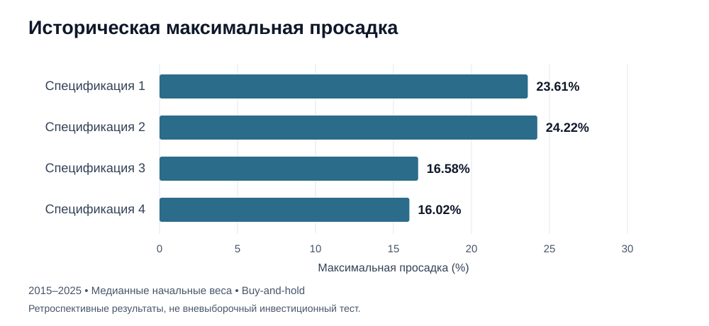

# Оптимизация всепогодного портфеля

[](https://doi.org/10.5281/zenodo.20232640)
[](LICENSE)
[](https://www.python.org/)

[English](README.md) | **Русский**

Исследовательский проект на Python о том, как распределение активов всепогодного портфеля меняется при выборе разных критериев риска и доходности, наборов активов и исторических окон. Эмпирическое исследование использует российские индексы акций и облигаций, а также золото за период **с 14 января 2015 г. по 30 декабря 2025 г.**

Репозиторий содержит код, исходные данные и результаты моей магистерской диссертации и последующего исследования, подготовленного для научной публикации.

**Автор:** Лев Казаков  
**Научный руководитель:** А. О. Солдатова, кандидат экономических наук, доцент

## Кратко о проекте

- **Вопрос:** Насколько распределение активов чувствительно к выбору критерия оптимизации, временного окна и набора активов?
- **Реализация:** Подготовка рыночных данных, портфельная оптимизация с ограничениями, сравнение с бенчмарками, анализ чувствительности и эконометрический анализ на Python.
- **Основной результат:** Эмпирические диапазоны весов вместо единственного предположительно оптимального портфеля.
- **Инструменты:** pandas, NumPy, SciPy, statsmodels, Matplotlib, seaborn и тесты внутри ноутбука.
- **С чего начать:** [Основной ноутбук](main_code.ipynb) · [Установка и запуск](#быстрый-запуск) · [Ограничения](#ограничения)

> Это ретроспективное исследование, а не инвестиционная рекомендация или торговая система для реального рынка. Веса портфеля оцениваются на всей исторической выборке, поэтому прогнозная проверка не является полностью вневыборочным тестом процедуры формирования портфеля.
>
> Автор подтверждает, что результаты в README подготовлены после последнего запуска ноутбука, а код расчетов с тех пор не менялся. Это обновление документации не является независимым повторным запуском или проверкой численных результатов. Реализация и исходные результаты представлены в ноутбуке и выгруженных таблицах.

## Дизайн исследования

В исследовании сравниваются четыре набора активов, включающие индексы акций Московской биржи, индексы облигаций (в том числе российских облигаций федерального займа, или **ОФЗ**) и золото.

Основное предположение о портфеле – **buy-and-hold**:

- Начальные веса активов определяются процедурой оптимизации.
- После формирования портфеля ребалансировка не проводится.
- Доходность портфеля учитывает последующее изменение фактических весов активов.
- Базовая безрисковая ставка – среднее дневных значений годовой бескупонной доходности ОФЗ за всю выборку: **9.57%**.
- Минимально приемлемая доходность (**MAR**) объединяет среднюю инфляцию 7.33% и реальную премию 3 процентных пункта с учетом сложного процента: **10.55%**.
- При агрегировании результатов каждая группа «метрика–конфигурация» получает одинаковый вес.

Синхронизированные наборы данных содержат **2062–2063 наблюдения за торговые дни** в зависимости от набора активов.

### Сетка оптимизации

Каждый из **восьми критериев** оценивается по **27 конфигурациям**:

| Параметр | Значения |
|---|---|
| Историческое окно | 2, 3 или 4 года |
| Сдвиг окна | 2, 3 или 6 месяцев |
| Сила тихоновской регуляризации | 0, 0.05 или 0.10 |
| Ограничения портфеля | Только длинные позиции; не более 60% на актив |

Критерии: коэффициент Шарпа, коэффициент Сортино, коэффициент Кальмара, CVaR ratio (α = 0.05), Martin ratio, коэффициент Омега, волатильность и максимальная просадка.

Результаты оптимизации обобщаются в виде **эмпирических диапазонов весов (P10–P90)** по **216 группам «метрика–конфигурация»**. Это диапазоны чувствительности, а не статистические доверительные интервалы или рекомендуемые торговые веса.

## Результаты портфельного анализа

### Наборы активов

| Спецификация | Ряды данных по активам | Наблюдений |
|---|---|---|
| 1 | MCFTR, RUABITR, GLDRUB_TOM | 2062 |
| 2 | MCFTR, RGBITR, GLDRUB_TOM | 2063 |
| 3 | MCFTR, RUGBITR3Y, RUGBITR10Y, GLDRUB_TOM | 2063 |
| 4 | MEBCTR, RUGBITR3Y, RUGBITR10Y, GLDRUB_TOM | 2062 |

### Медианные веса

| Спецификация | Акции | Облигации / ОФЗ с меньшим сроком | ОФЗ с большим сроком | Золото |
|---|---|---|---|---|
| 1 | 18.69% | 52.13% (RUABITR) | – | 29.19% |
| 2 | 19.79% | 50.98% (RGBITR) | – | 29.23% |
| 3 | 10.41% | 54.07% (RUGBITR3Y) | 13.35% | 22.17% |
| 4 | 9.21% (MEBCTR) | 55.07% (RUGBITR3Y) | 13.52% | 22.20% |

Во всех спецификациях медианная доля золота превышает ориентир 15%, используемый для исходного всепогодного бенчмарка.

### Исторические показатели при медианных начальных весах

| Портфель | CAGR, % | Волатильность, % | Шарп | Сортино | Кальмар | Макс. просадка, % |
|---|---|---|---|---|---|---|
| Спецификация 1 | 15.84 | 10.59 | 0.540 | 0.596 | 0.671 | 23.61 |
| Спецификация 2 | 16.29 | 11.17 | 0.552 | 0.618 | 0.673 | 24.22 |
| Спецификация 3 | 14.85 | 8.41 | 0.552 | 0.591 | 0.896 | 16.58 |
| Спецификация 4 | 14.82 | 8.11 | 0.566 | 0.605 | 0.926 | 16.02 |
| Равновзвешенный (набор активов Спецификации 3) | 15.77 | 12.09 | 0.483 | 0.530 | 0.576 | 27.41 |
| Исходные веса Далио (набор активов Спецификации 3) | 15.27 | 13.53 | 0.414 | 0.439 | 0.457 | 33.44 |
| 60/40 (MCFTR/RGBITR) | 11.98 | 17.25 | 0.192 | 0.173 | 0.270 | 44.41 |
| 100% акции (MCFTR) | 17.40 | 26.61 | 0.383 | 0.462 | 0.328 | 53.05 |
| 100% золото | 19.59 | 24.48 | 0.462 | 0.622 | 0.391 | 50.09 |

CAGR – среднегодовой темп роста с учетом сложного процента. Максимальная просадка показана как положительная величина потери.

На этой выборке четырехактивные спецификации имеют меньшую максимальную просадку (16.0–16.6% против 23.6–24.2% у трехактивных вариантов) и более высокий коэффициент Кальмара. Их CAGR также ниже; эти результаты не доказывают универсального превосходства или будущей результативности.



*Иллюстрация значений максимальной просадки из таблицы выше; без новых расчетов.*

### Чувствительность весов

| Спецификация | Средняя ширина диапазона P10–P90, процентных пунктов |
|---|---|
| 1 | 56.05 |
| 2 | 55.05 |
| 3 | 52.25 |
| 4 | 51.98 |

Широкие диапазоны отражают чувствительность к критерию и историческому подпериоду, а не ошибку численного округления.

Пересчет диапазонов на сокращенных наборах из семи критериев (без максимальной просадки) и пяти критериев дает максимальный сдвиг границы **3.70 процентного пункта**. Медианные веса более чувствительны: наибольший сдвиг составляет **15.59 процентного пункта** для Спецификации 1 при узком наборе критериев.

Для Спецификации 3 размах показателей между наборами критериев составляет 0.008 для Шарпа, 0.051 для Сортино, 0.180 для Кальмара и 5.895 процентного пункта для максимальной просадки.

### Устойчивость ранжирования

**Ранжирование спецификаций неустойчиво и не представляется как основной результат.**

Блочный бутстрап с 1000 повторениями и блоками по 63 дня сохраняет лидирующую спецификацию в 35.0% повторений по итоговой доходности, 36.4% по Сортино и 47.0% по CVaR ratio. Средние ранговые корреляции находятся в диапазоне 0.20–0.60.

Проверка с последовательным исключением одного года более устойчива: порядок по максимальной просадке и Кальмару меняется только при исключении 2022 года.

Спецификации 3 и 4 достаточно близки, поэтому их исторические метрики не позволяют уверенно предпочесть одну другой.

## Регрессионный анализ

Зависимая переменная – **месячная логарифмическая доходность того же buy-and-hold портфеля Спецификации 3** с медианными начальными весами. Модели оцениваются методом наименьших квадратов с **состоятельными при гетероскедастичности и автокорреляции (HAC) стандартными ошибками**.

### Сравнение теоретически заданных моделей

| Модель | Добавленная переменная | Параметров | R² | Скорректированный R² | BIC | HAC-Wald p |
|---|---|---|---|---|---|---|
| M1 Рынок | MOEXBMI | 2 | 0.4322 | 0.4273 | −691.98 | – |
| M2 + Валютный курс | EUR_RUB | 3 | 0.5412 | 0.5333 | −712.77 | 0.0003 |
| M3 + Ставки | yield_spread | 4 | 0.5751 | 0.5641 | −717.21 | 0.0175 |
| M4 + Активность | org_turnover | 5 | 0.6055 | 0.5918 | −721.32 | 0.0001 |
| M5 + Торговля | import_value | 6 | 0.6091 | 0.5919 | −717.63 | 0.1640 |

Основная модель – **M4 (N = 120)**: MOEXBMI, EUR/RUB, спред доходностей 10Y–1Y и оборот организаций. Добавление импорта в M5 не дает статистически значимого улучшения модели.

### Коэффициенты основной модели

| Переменная | Коэффициент | HAC SE | p | Стандартизированный коэффициент |
|---|---|---|---|---|
| const | 0.00990 | 0.00158 | 0.0000 | – |
| MOEXBMI | 0.19663 | 0.02999 | 0.0000 | 0.704 |
| EUR_RUB | 0.09772 | 0.02607 | 0.0002 | 0.318 |
| yield_spread | 0.00363 | 0.00176 | 0.0390 | 0.144 |
| org_turnover | −0.02906 | 0.00726 | 0.0001 | −0.181 |

Эти коэффициенты описывают условные исторические ассоциации, а не причинные эффекты. Значения p = 0.0000 округлены и не означают точного равенства нулю.

### Диагностика

| Тест | Статистика | p | Нулевая гипотеза при α = 0.05 |
|---|---|---|---|
| Ljung–Box(12) | 19.755 | 0.0719 | Не отвергается |
| Jarque–Bera | 1.117 | 0.5720 | Не отвергается |
| Breusch–Pagan | 12.092 | 0.0167 | Отвергается |
| White | 45.837 | 0.0000 | Отвергается |
| Ramsey RESET | 6.540 | 0.0119 | Отвергается |
| CUSUM | 1.466 | 0.0272 | Отвергается |

HAC-стандартные ошибки учитывают гетероскедастичность и автокорреляцию при статистическом выводе. Они не устраняют возможную неверную спецификацию функциональной формы и нестабильность параметров, на которые указывают RESET и CUSUM; эти проблемы остаются ограничениями.

### Скользящая регрессия

Анализ использует **61 скользящее окно по 60 месяцев**.

| Переменная | Коэффициент на полной выборке | Медиана по окнам | Стабильность знака | Доля с p < 0.05 |
|---|---|---|---|---|
| MOEXBMI | 0.1966 | 0.2214 | 100% | 100% |
| EUR_RUB | 0.0977 | 0.1038 | 100% | 96.7% |
| yield_spread | 0.0036 | 0.0031 | 72.1% | 47.5% |
| org_turnover | −0.0291 | −0.0238 | 100% | 93.4% |

Спред доходностей – наименее устойчивый фактор модели.

### Псевдовневыборочное прогнозирование

Проверка с расширяющимся окном использует не менее 60 месяцев обучающих данных и дает 58 прогнозов. Лаги доступности данных составляют один месяц для рынка, валютного курса и спреда доходностей и два месяца для оборота и импорта.

| Модель | MAE | RMSE | OOS R² относительно расширяющегося среднего | Точность направления |
|---|---|---|---|---|
| Рынок с лагом 1 | 0.01633 | 0.02241 | −0.013 | 68.97% |
| Основная M4 | 0.01545 | 0.02125 | 0.089 | 60.34% |
| Расширенная M5 | 0.01557 | 0.02137 | 0.079 | 60.34% |

Приведенные тесты Кларка–Уэста показывают преимущество M4 над бенчмарком расширяющегося среднего (p = 0.0009) и моделью только с рынком (p = 0.0037). M5 не улучшает M4 (p = 0.80).

**Оговорка:** Веса портфеля оценены на всей исторической выборке. Эта проверка оценивает прогнозирование при условии уже заданного портфеля, а не полностью вневыборочный инвестиционный процесс.

### Дрейф весов и ребалансировка

Для гипотетического портфеля с ежемесячной ребалансировкой та же регрессионная спецификация дает R² = 0.5450 против 0.6055 для buy-and-hold. Среднегодовая разность логарифмических доходностей (buy-and-hold минус ежемесячная ребалансировка) составляет −0.0058.

Подробные результаты доступны в [tables/regression](tables/regression).

## Дополнительные проверки чувствительности

- **Безрисковая ставка:** Метрики пересчитаны с использованием средних значений бескупонной доходности ОФЗ 1Y (9.57%), доходностей 3Y, 10Y и 20Y, а также RUONIA (10.32%). Коэффициент Шарпа Спецификации 3 находится в диапазоне 0.462–0.552. Ранжирование не полностью устойчиво, но наибольший разброс коэффициента Шарпа между спецификациями при фиксированной ставке составляет лишь 0.027. Ранжирование по Сортино и другим метрикам, не зависящим от ставки, не меняется.
- **Бенчмарк MOEXALLW:** Этот индекс используется для сравнения, а не как цель репликации. Общая выборка содержит всего 161 наблюдение (13 марта – 30 декабря 2025 г.), поэтому годовые показатели не устанавливают долгосрочную результативность. Приведенные относительные показатели: корреляция 0.424, бета 0.340 и ошибка следования 9.89%.
- **Оптимизатор:** В документации исследования указано, что решения SLSQP с мультистартом сверены с differential evolution по всем спецификациям; расхождения находятся в пределах допуска.

### Корреляции активов для Спецификации 3

| | MCFTR | RUGBITR3Y | RUGBITR10Y | GLDRUB_TOM |
|---|---|---|---|---|
| MCFTR | 1.00 | 0.50 | 0.54 | −0.01 |
| RUGBITR3Y | 0.50 | 1.00 | 0.79 | −0.04 |
| RUGBITR10Y | 0.54 | 0.79 | 1.00 | −0.13 |
| GLDRUB_TOM | −0.01 | −0.04 | −0.13 | 1.00 |

Золото имеет низкие исторические корреляции с остальными активами, что согласуется с его диверсифицирующей ролью на этой выборке.

## Структура репозитория

```text
.
├── main_code.ipynb                    # Основной исследовательский ноутбук
├── data/                              # Исходные рыночные и макроэкономические данные
│   ├── ofz/                           # Данные по ОФЗ
│   ├── золото/                        # Данные по золоту
│   ├── индексы_акций/                 # Индексы акций Московской биржи
│   ├── индексы_облигаций/             # Индексы облигаций Московской биржи
│   └── данные для регрессии/          # Рыночные и макроэкономические факторы
├── tables/regression/                 # Выгруженные результаты регрессий
├── Данные_для_графиков_статьи.xlsx     # Данные для графиков статьи
├── Данные_для_статей/                 # Дополнительные выгрузки данных для статей
├── requirements.txt                   # Зафиксированные зависимости Python
├── CITATION.cff                       # Метаданные для цитирования
├── LICENSE                            # Лицензия MIT
├── README.md                          # Английская документация
└── README.ru.md                       # Русская документация
```

Ноутбук также создает `cache/` для кешированных расчетов и `figures/` для графиков. Некоторые имена каталогов, комментарии ноутбука и подписи результатов остаются на русском; английский README не переименовывает файлы данных и не меняет код.

В ноутбук включены тесты, вызываемые через `run_notebook_tests(...)`. Неуспешные тесты вызывают ошибку при выполнении.

## Быстрый запуск

В документированном окружении используется **Python 3.13**; метаданные ноутбука и файл зависимостей указывают Python 3.13.9.

### 1. Клонирование репозитория и создание окружения

```bash
git clone https://github.com/levkazakov2002/master_degree_diploma_code.git
cd master_degree_diploma_code
python -m venv .venv
```

Активируйте окружение в **Windows PowerShell**:

```powershell
.venv\Scripts\Activate.ps1
```

Или в **Linux/macOS**:

```bash
source .venv/bin/activate
```

### 2. Установка зависимостей и открытие ноутбука

```bash
python -m pip install --upgrade pip
python -m pip install -r requirements.txt
python -m pip install jupyterlab
jupyter lab main_code.ipynb
```

### 3. Запуск анализа

Запускайте ноутбук из корня репозитория. Перезапустите ядро и выполните все ячейки по порядку.

Кеширование управляется переменной `CACHE_POLICY`. Для пересчета кешированных расчетов установите:

```python
CACHE_POLICY = "refresh"
```

При первом запуске необходим доступ к интернету для получения некоторых показателей Банка России. Загруженные данные кешируются в `cache/`.

Метаданные статуса выполнения ноутбука отражают подтверждение автора о последнем завершенном запуске. Устаревшие отметки о необходимости пересчета заменены; ячейки кода и сохраненные результаты не изменены. Независимое полное выполнение в рамках этого обновления документации не проводилось.

## Источники данных

- [Московская биржа](https://www.moex.com/): индексы акций и облигаций, золото.
- [Банк России](https://www.cbr.ru/): бескупонные кривые доходности ОФЗ, валютные курсы, RUONIA, ключевая ставка и ставки по депозитам.
- [Росстат](https://rosstat.gov.ru/): макроэкономические показатели.

Загрузка, очистка, преобразование и синхронизация данных описаны в [main_code.ipynb](main_code.ipynb).

## Ограничения

- Историческая результативность не является прогнозом или обещанием инвестиционной доходности.
- Регрессионные коэффициенты описывают ассоциации, а не причинные связи.
- Ранжирование портфельных спецификаций статистически неустойчиво.
- Диапазоны весов отражают чувствительность к моделированию; это не доверительные интервалы.
- Оценка весов портфеля на полной выборке ограничивает интерпретацию псевдовневыборочного прогнозирования.
- HAC-стандартные ошибки не устраняют проблемы функциональной формы или структурной устойчивости.
- Выводы относятся к изученным активам, периоду и предположениям; их нельзя автоматически переносить на другие рынки.

## Цитирование

В репозитории **v2.0.0** указана как архивная версия программного обеспечения, связанная с результатами статьи:

- [DOI конкретной версии: 10.5281/zenodo.21632648](https://doi.org/10.5281/zenodo.21632648)
- [Общий DOI, объединяющий все версии: 10.5281/zenodo.20232640](https://doi.org/10.5281/zenodo.20232640)

Используйте версию, соответствующую фактически используемому коду. Текущая основная ветка может отличаться от архивного релиза.

Меню GitHub **Cite this repository** использует английские метаданные из [CITATION.cff](CITATION.cff). Английское название программного обеспечения – перевод исходного русского названия, а не новый релиз или изменение записи DOI. Запись программного обеспечения ниже использует те же английские метаданные; запись диссертации сохраняет исходные библиографические сведения на русском.

<details>
<summary>BibTeX: программное обеспечение и магистерская диссертация</summary>

```bibtex
@software{kazakov2026allweather_code,
  author       = {Kazakov, Lev Konstantinovich},
  title        = {Application of Mathematical Methods to
                  All-Weather Portfolio Optimisation},
  year         = {2026},
  publisher    = {Zenodo},
  version      = {2.0.0},
  doi          = {10.5281/zenodo.21632648},
  url          = {https://doi.org/10.5281/zenodo.21632648},
  note         = {ORCID: 0009-0001-2203-6245;
                  Web of Science ResearcherID: QSP-3560-2026;
                  SPIN-код: 4919-4233;
                  Science Index Author ID: 1355531}
}

@mastersthesis{kazakov2026allweather_thesis,
  author       = {Казаков, Лев Константинович},
  title        = {Использование математических методов
                  для оптимизации всепогодного портфеля},
  school       = {Московский институт электроники и математики
                  им. А. Н. Тихонова, НИУ ВШЭ},
  year         = {2026},
  address      = {Москва},
  type         = {Магистерская диссертация}
}
```

</details>

### Идентификаторы автора

- [ORCID: 0009-0001-2203-6245](https://orcid.org/0009-0001-2203-6245)
- Web of Science ResearcherID: `QSP-3560-2026`
- SPIN-код РИНЦ: `4919-4233`
- Science Index Author ID: `1355531`

## Лицензия

Код доступен по [лицензии MIT](LICENSE). При повторном использовании или распространении сохраняйте уведомление об авторских правах и текст лицензии.

## Контакты

**Лев Казаков** · [prorab651@gmail.com](mailto:prorab651@gmail.com)
